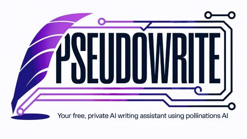

# PseudoWrite: Your Free, Private AI Writing Assistant

> 

**PseudoWrite** is a powerful, self-contained AI writing assistant that is **completely free to use**, thanks to its integration with the [Pollinations AI](https://pollinations.ai/) network. It requires no sign-up, no API keys, and no server-side processing.

This tool runs entirely in your browser, and all your projects, documents, and story ideas are saved directly and privately to your computer's local storage. It combines robust document management with a deep, AI-integrated **Story Bible** to help you maintain consistency and spark creativity, all without any hidden costs.

## ✨ Core Philosophy: Democratizing Creativity

PseudoWrite is built on a simple but powerful idea: creative AI tools should be accessible to everyone, without cost or privacy compromises.

*   **Zero-Cost AI:** By leveraging the free, community-powered Pollinations AI endpoint, PseudoWrite removes the financial barrier to entry common with other AI writing tools.
*   **Total Ownership:** Since it's a single HTML file, you can save it, modify it, and use it offline forever. You are in complete control of your writing environment.

## 📚 Key Features

### Project & Document Management
*   **Multi-Project Organization:** Create and switch between distinct writing projects.
*   **Document Handling:** Each project can contain multiple documents (e.g., chapters, notes).
*   **Per-Document Story Bible:** Each document maintains its own unique Story Bible, allowing you to work on multiple distinct stories within a single project.
*   **Persistent State:** Your active project, document, and all content are automatically saved and reloaded on your next visit.

### The Story Bible: Your Single Source of Truth
The collapsible Story Bible is deeply integrated into every AI action, providing essential context to the free AI for generating relevant and consistent content.

*   **Braindump, Genre, Style, & Synopsis:** Core sections to define the high-level vision of your story. The synopsis can be AI-generated from your other notes.
*   **👥 Character Management:**
    *   Organize characters by role (Protagonist, Antagonist, etc.).
    *   Use the powerful **"Refine with AI"** feature. Simply provide a role and a basic description, and the AI will populate a rich profile including appearance, personality, goals, and flaws.
*   **🌍 Worldbuilding:**
    *   Categorize elements by type (Location, Faction, Magic System, etc.).
    *   Use **"Refine with AI"** to expand a simple idea into a detailed worldbuilding entry with a name, type, and story significance.
*   **🗺️ Outline:**
    *   Create and reorder editable story beats.
    *   Generate a complete story outline from your synopsis with a single click.

### 🤖 Free AI-Powered Writing Core
*   **Write:** Have the AI continue writing from your cursor's position, follow a specific instruction, or adopt a new tone.
*   **Rewrite:** Select any piece of text and generate multiple alternative versions to find the perfect phrasing.
*   **Describe:** Enhance a moment by adding rich sensory details (sight, sound, smell, etc.) without advancing the plot.
*   **Brainstorm:** Get a list of ideas for any topic, from character names to plot points, inserted directly into your editor.

### 🔌 Advanced AI Tools & Plugins
*   **Generate 3 Openings:** Kickstart your story by generating three distinct opening paragraphs based on your Story Bible.
*   **Generate a Twist:** Create an unexpected plot twist based on your existing synopsis.
*   **Scene Ender:** Generate three potential endings for your current scene: a cliffhanger, an emotional beat, and a revelation.
*   **Write with More Dialogue:** Automatically rewrite a block of prose-heavy text to be more dynamic and dialogue-driven.
*   **Visualize:** Convert a descriptive passage into a detailed prompt ready for an image generation AI like Midjourney or DALL-E.

---

## 🚀 Instant Setup - No Configuration Needed!

PseudoWrite is designed for immediate use. There are no API keys to get, no accounts to create, and no software to install.

1.  **Download the File:** Get the `ps.html` file from this repository.
2.  **Open in Your Browser:** Simply drag and drop the `ps.html` file into a modern web browser like Chrome, Firefox, or Edge.

That's it! The AI is already connected and ready to go. Start writing.

---

## 💡 How It Works

*   **Tech Stack:** Pure HTML5, CSS3, and Vanilla JavaScript (ES6+). No frameworks, no libraries, no external dependencies.
*   **Pollinations AI Integration:** Utilizes the free, community-powered Pollinations AI endpoint for all generative text features, which acts as a proxy to powerful language models. This is the magic that makes the tool free to use.
*   **Local-First State Management:** The entire application state (all your projects and writing) is a single JavaScript object that is serialized to JSON and stored in your browser's `localStorage`.
*   **Document-Centric Data Model:** The `storyBible` object is tied directly to each `document`, not the `project`. This provides true separation between different stories or drafts, allowing for greater creative flexibility.

## 🤝 Contributing

Contributions are welcome! If you have ideas for new features, bug fixes, or improvements, please feel free to fork the repository, make your changes, and submit a pull request.

## 📜 License

This project is licensed under the MIT License. See the [LICENSE](LICENSE) file for details.